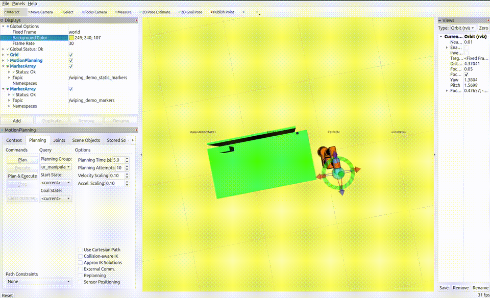
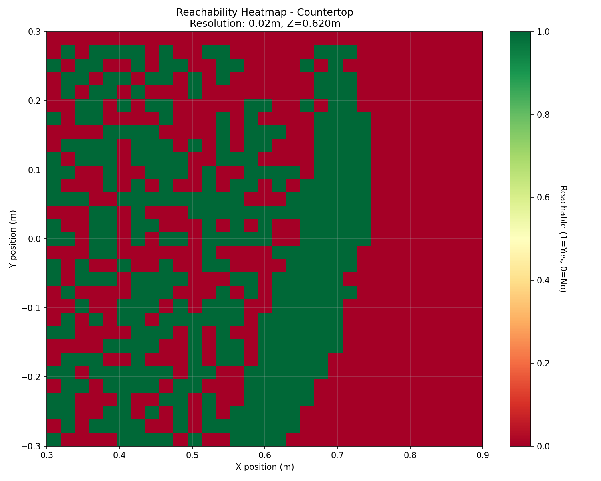
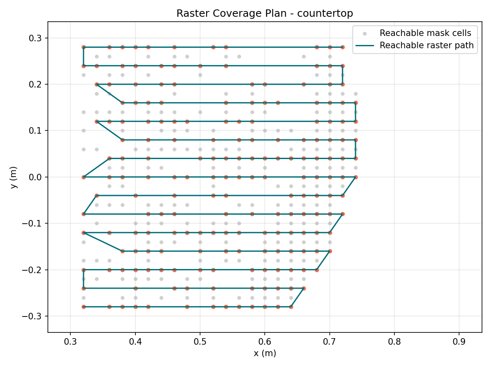
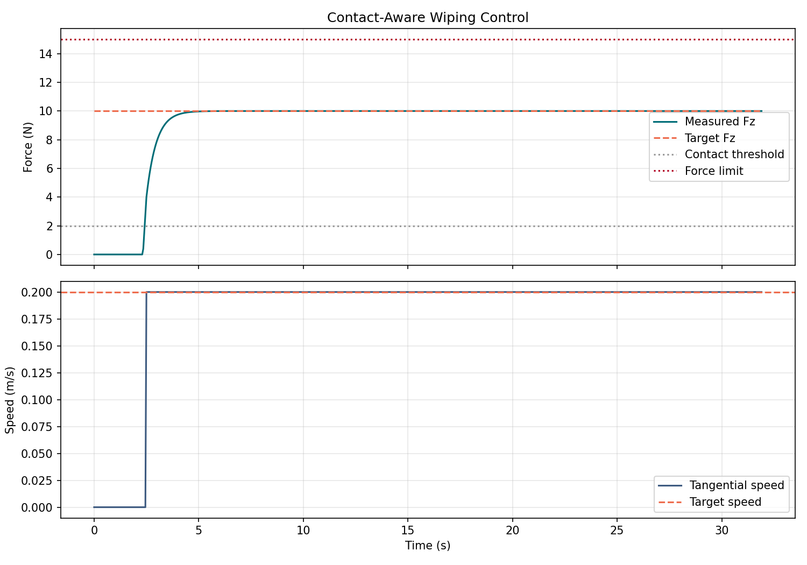

# MoveIt 2 Surface Wiping Demo

This repository implements a countertop wiping workflow for a 6-DOF arm in MoveIt 2. The delivered scope covers the minimum required pipeline for the countertop task: scene setup, collision-aware IK reachability analysis, raster coverage planning, and a simulated contact-aware wiping controller with logging and RViz replay support.

The robot used for validation is `ur5e` with the Universal Robots Jazzy stack.

## Simulation Environment

I use MoveIt 2 to visualize the robot arm and scene, which includes a `120 x 60 cm` countertop slab, a faucet obstacle, and a `90 x 60 cm` vertical mirror.

## Scope

Implemented:

- Section 1: environment setup, IK service, 60 x 60 cm reachability map at 2 cm resolution
- Section 2: raster coverage planning for the countertop with keep-out margin and overlap
- Section 3: simulated contact-aware wiping control, force/velocity logging, RViz replay markers

Due to the time and ability limit, this repo does not finish:

- mirror wiping strategy
- spiral coverage strategy
- real force sensor or hardware force control
- full local replanning around the faucet

## Demo



## Section 1: Kinematics and Reachability

In this section, the scene is built around a standard `ur5e` 6-DOF robot arm. A custom `ik_service` node wraps MoveIt 2 `/compute_ik` and exposes a simpler reachability query service for surface-aligned wiping poses. The reachability CSV is saved as `reachability_map_20260322_213355.csv` in `outputs/`, and the heatmap is shown below:



In this project, a point is treated as reachable only if MoveIt 2 can return a collision-aware IK solution for the requested surface pose. The service rejects points outside the configured `60 x 60 cm` patch, points at the wrong surface height, and points for which no valid collision-free IK solution exists under the chosen wiping orientation.

Current result summary:

- sampled points: `961`
- reachable points: `383`
- reachable ratio: `39.85%`
- dominant failure mode: `ik_failed` on `517` points
- bounds-rejected points: `61`

Interpretation:

- the central countertop region is reachable more often than the boundary
- the fixed wiping orientation reduces valid IK solutions
- collision-aware IK rejects solutions that would intersect the planning scene
- the chosen TCP orientation convention matters, because a wrong tool-to-surface alignment changes both reachability and wiping direction

## Section 2: Surface Coverage Path Planning

In this section, I build on the reachability result from Section 1 to generate a wiping path over the countertop. The implemented strategy is a simple raster sweep over the reachable subset of the patch. The planner first loads or recomputes a reachability mask, applies the `15 mm` keep-out margin, and then samples raster waypoints using the configured pad size, overlap, and waypoint step.

The result is shown below: 



Current result summary:

- reachable waypoints: `191`
- waypoint x-range: `0.32 m` to `0.74 m`
- waypoint y-range: `-0.28 m` to `0.28 m`
- coverage: `76.22%`
- path length: `6.27 m`
- estimated execution time: `1702.68 s`

Design note:

The joint trajectory output is a joint-state sequence with simple timing estimation from inter-waypoint joint deltas. It is suitable for evaluation and reporting, but it is not a full MoveIt time-parameterized execution trajectory.

Besides, due to the time limit, the spiral coverage plan is not implemented. My current understanding is that raster is the more reasonable baseline for this project because the reachable region is not continuous everywhere and the current planner only samples discrete reachable cells. A spiral strategy would be more natural on a smoother and more uniformly reachable surface, but it would need additional logic to handle discontinuities, orientation changes for the mirror, and path continuity between cells.

Another limitation of the current raster implementation is that waypoint reachability is checked point-by-point; it does not prove that every motion segment between adjacent waypoints is itself collision-free or dynamically executable. So the generated joint trajectory should be read as an evaluation artifact rather than a strict execution-ready motion plan.

## Section 3: Contact-Aware Wiping Control

Implemented:

- a simulated wiping controller with `APPROACH`, `CONTACT`, and `BACKOFF` modes
- switch to contact mode when `|Fz| > 2 N`
- target countertop force tracking at `10 N`
- target countertop tangential speed at `0.20 m/s`
- safety backoff when `|Fz| > 15 N`
- obstacle handling by skipping faucet keep-out waypoints
- force and velocity logging
- RViz replay markers for demo recording

The results are shown below, the plot shows force regulation and tangential speed over time:



Current result summary:

- surface: `countertop`
- target force: `10.0 N`
- target speed: `0.20 m/s`
- simulated duration: `31.9 s`
- total waypoints: `191`
- skipped waypoints: `0`
- contact switches: `1`
- backoff events: `0`

This section is implemented as a simulated controller over the planned Cartesian waypoints. It uses a simple state machine with `APPROACH`, `CONTACT`, and `BACKOFF` states, plus a spring-like contact-force model from penetration depth. This is enough to demonstrate the intended control logic and produce force/velocity logs, but it is not a hardware-grade impedance controller.


## Build

```bash
cd /home/sihan/ws_wiping
rosdep install --from-paths src --ignore-src -r -y
colcon build --packages-select moveit2_surface_wiping_demo moveit2_surface_wiping_interfaces
source install/setup.bash
```

## Run With UR5e

Terminal 1:

```bash
ros2 launch ur_robot_driver ur_control.launch.py \
    ur_type:=ur5e \
    robot_ip:=192.168.56.101 \
    use_mock_hardware:=true \
    launch_rviz:=false
```

Terminal 2:

```bash
ros2 launch ur_moveit_config ur_moveit.launch.py \
    ur_type:=ur5e \
    launch_rviz:=true
```

Section 1:

```bash
source /home/sihan/ws_wiping/install/setup.bash
ros2 launch moveit2_surface_wiping_demo demo.launch.py \
    planning_group:=ur_manipulator \
    end_effector_link:=tool0
```

This launches:

- `scene_setup`: publishes the countertop, faucet, and mirror collision objects
- `ik_service`: wraps `/compute_ik` into the custom `reachability_query` service
- `reachability_map`: samples the `60 x 60 cm` patch and exports CSV + heatmap

Section 2:

```bash
source /home/sihan/ws_wiping/install/setup.bash
ros2 launch moveit2_surface_wiping_demo coverage.launch.py \
    planning_group:=ur_manipulator \
    end_effector_link:=tool0
```

This launches the scene, the same IK service, and the `coverage_planner`, which consumes the reachability result and exports coverage metrics, waypoints, a joint-state trajectory CSV, and a plot.

Section 3:

```bash
source /home/sihan/ws_wiping/install/setup.bash
ros2 launch moveit2_surface_wiping_demo control.launch.py
```

This loads the latest coverage waypoint CSV and runs the simulated wiping controller, exporting log CSVs, summary metrics, and the force/velocity plot.

Section 3 RViz replay:

Add two `MarkerArray` displays in RViz:

- `/wiping_demo_static_markers`
- `/wiping_demo_markers`

Then run:

```bash
source /home/sihan/ws_wiping/install/setup.bash
ros2 launch moveit2_surface_wiping_demo control_viz.launch.py playback_rate:=1.0
```


## Limitations and Trade-Offs

- The delivered task scope is countertop wiping only. The mirror is modeled in the scene but is not implemented as a full wiping target.

- Faucet and mirror are included in the MoveIt planning scene, so they affect collision-aware IK reachability queries. The coverage planner itself does not perform explicit 2D obstacle-footprint carving on the wiping surface.

- Obstacle handling in Section 3 is waypoint skipping logic around the faucet keep-out region, not local replanning. In the current scene configuration and current reachability patch, the generated countertop path does not enter the faucet keep-out region, so the latest output shows `0` skipped waypoints.

- The RViz replay shows the simulated controller state using markers; it does not drive the UR5e joints through the wiping log.

- The joint trajectory output is an evaluation artifact derived from IK samples, not a full execution-ready trajectory from a motion planner.

